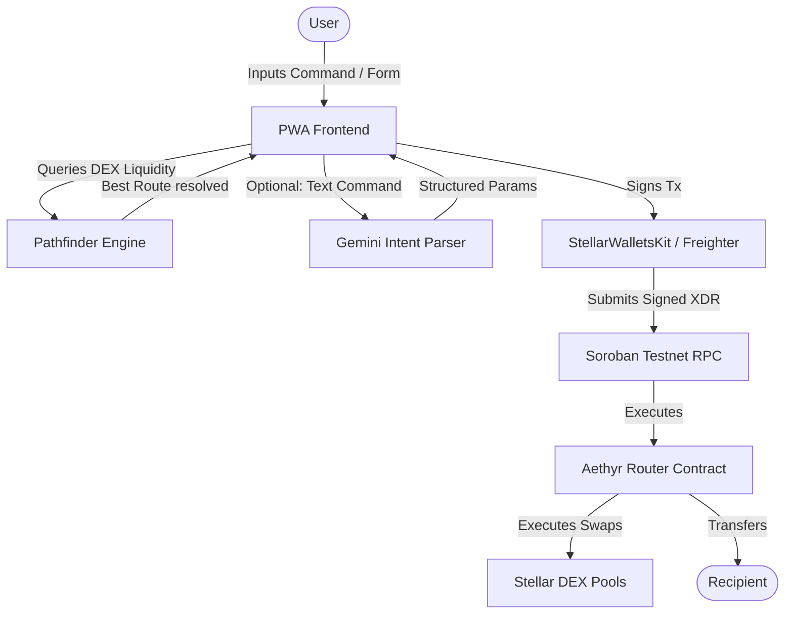
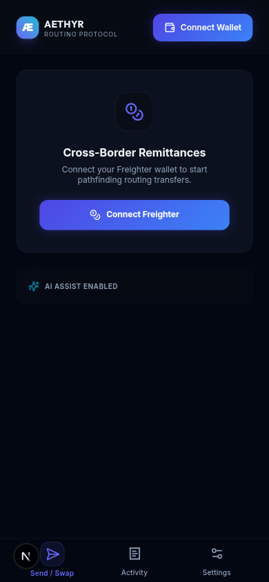
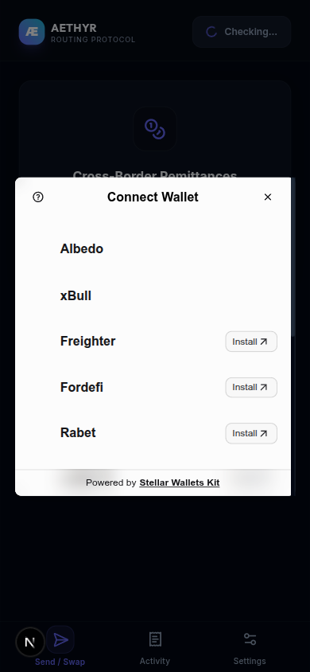
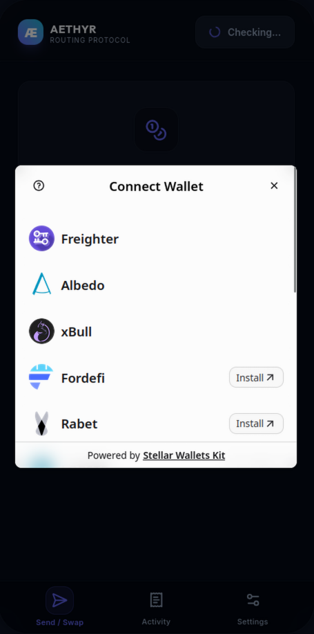
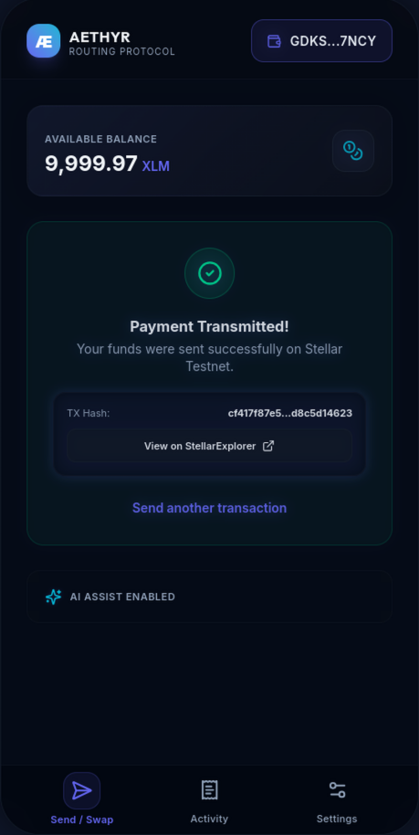
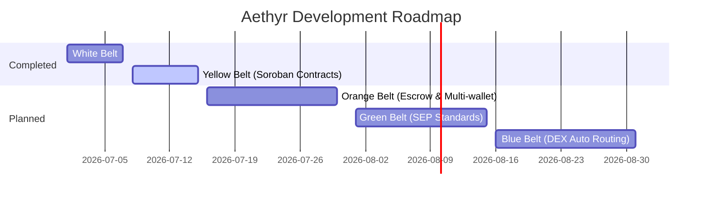

# Aethyr Hero Banner
<p align="center">
  
</p>

<h1 align="center">🌌 Aethyr</h1>
<p align="center">
  <strong>Intelligent, Intent-Based Cross-Border Payment Routing on Stellar</strong>
</p>

<p align="center">
  <a href="https://github.com/pablo-pica/stellar-jtm/actions"></a>
  
  
  
  
  
</p>

---

## 💡 Value Proposition

Aethyr is an intent-based, cross-border payment router built on the Stellar network. By combining natural language artificial intelligence and decentralized exchange (DEX) liquidity, Aethyr optimizes multi-currency transaction paths in real-time to minimize fee footprints and slippage.

Traditional international remittance networks impose significant overhead through high flat fees, wide conversion spreads, and settlement delays. Aethyr addresses these issues through three main pillars:
* **AI-Driven Intent Parsing**: Users specify transactions in plain language (e.g., *"Send 50 USD equivalent in PHP to Bob for completing Milestone 1"*). Aethyr translates these inputs into structured transaction payloads.
* **DEX Pathfinding**: Aethyr calculates the most cost-effective path across Classic DEX orderbooks, automated market makers (AMMs), and Soroban liquidity pools (e.g., `PHP ➔ USDC ➔ XLM ➔ NGN`), maximizing the recipient's payout.
* **Non-Custodial Escrows**: Funds are secured inside modular Soroban milestone escrow contracts, releasing capital incrementally as milestones are completed and verified by trust anchors.

---

## 🏆 Core Achievements

During the initial engineering phase, we successfully established a production-grade infrastructure:

* 🦊 **Freighter Wallet Hooks**: Developed a modular custom hook [useFreighter.ts](file:///home/pablo-pica/Documents/programming/stellar-jtm/src/hooks/useFreighter.ts) that manages connection states, checks network compatibility, and interfaces with the Freighter browser extension API.
* 🪙 **Native Testnet Transfers**: Fully integrated native XLM transfers with real-time balance queries via Stellar Horizon APIs, complete with transaction builders and user signing flows.
* 📱 **PWA-Ready Layout**: Created an installable Progressive Web App layout. Key styling features include safe notched margins (`env(safe-area-inset-*)` calculated dynamically in CSS) and a glassmorphic sidebar profile drawer designed specifically for mobile viewports.
* 🧪 **Robust Test Suite (9/9)**: Delivered comprehensive integration and unit tests covering wallet components, profile drawer layouts, and utilities. Active pre-commit security hooks prevent key leaks and run test suites before every commit.

---

## 🎬 Live Demo & Presentation

* 🌐 **Live Application**: [Aethyr on Vercel](https://aethyr-pica.vercel.app/)
* 🎥 **Video Walkthrough (1-2 Min)**: [Aethyr Demo Video](https://loom.com/your-video-link)

---

## 🏗️ System Architecture

Aethyr connects users, AI models, and Stellar smart contracts into a unified payment loop:



The client queries Horizon endpoints to identify active market makers while the Soroban smart contracts execute atomic, multi-hop swaps directly on-chain.

---

## 📂 Code Navigation

Below is a map of the repository's directory layout to assist in codebase evaluation:

```text
stellar-jtm/
├── .agents/                 # Developer agents instruction and status trackers
├── docs/                    # Design documentation, architecture files, and submission assets
│   ├── assets/              # Interface screenshots and project banners
│   ├── ARCHITECTURE.md      # Core system architecture and contract specs
│   ├── PROGRESS.md          # Real-time living development progress tracker
│   └── MASTERPLAN.md        # JTM milestones timeline and strategy plan
├── scripts/
│   └── pre-commit.sh        # Git compliance hook (scanning for private key leaks & running tests)
├── src/
│   ├── app/                 # Next.js App Router pages and layouts
│   │   ├── page.tsx         # Main entry point (interactive mobile mockup container)
│   │   ├── page.test.tsx    # Page component integration tests
│   │   └── layout.tsx       # Global wrappers and metadata setup
│   ├── components/          # Reusable React components
│   │   ├── BottomNav.tsx    # Mobile-friendly PWA bottom tab navigation
│   │   ├── ProfileDrawer.tsx# Wallet balance overview and account control drawer
│   │   ├── WalletConnect.tsx# Interactive wallet status controller
│   ├── hooks/
│   │   └── useFreighter.ts  # Custom hook wrapping the @stellar/freighter-api
│   ├── lib/
│   │   ├── utils.ts         # Tailwind CSS styling and address helper functions
│   │   └── utils.test.ts    # Utility unit tests
│   └── styles/
│       └── globals.css      # Core Tailwind styling & safe-area notch utility configuration
├── package.json             # Package scripts and external dependencies
├── tsconfig.json            # TypeScript configuration
└── vitest.config.ts         # Vitest setup configuration file
```

Here are the key implementation files:
* [page.tsx](file:///home/pablo-pica/Documents/programming/stellar-jtm/src/app/page.tsx): The primary container UI managing viewports, notched margin wrappers, tabs, and form submissions.
* [useFreighter.ts](file:///home/pablo-pica/Documents/programming/stellar-jtm/src/hooks/useFreighter.ts): Core wallet connection logic encapsulating network detection and sign/transfer commands.
* [ProfileDrawer.tsx](file:///home/pablo-pica/Documents/programming/stellar-jtm/src/components/ProfileDrawer.tsx): Side drawer container tracking wallet addresses and balance states.
* [BottomNav.tsx](file:///home/pablo-pica/Documents/programming/stellar-jtm/src/components/BottomNav.tsx): PWA layout switcher component handling navigation tabs.
* [pre-commit.sh](file:///home/pablo-pica/Documents/programming/stellar-jtm/scripts/pre-commit.sh): Custom git commit guard running automated test sweeps and Stellar seed regex leak filters.
* [vitest.config.ts](file:///home/pablo-pica/Documents/programming/stellar-jtm/vitest.config.ts): Configure JS DOM environment parameters for React rendering tests.

---

## 📱 Mobile App Viewports

Aethyr is designed to feel like a native mobile application. The interface scales to a true full-bleed layout on mobile devices, and displays inside a mock phone shell on desktop monitors.

| Wallet Connection | Wallet Details | Route Optimization | Transaction Receipt |
|:---:|:---:|:---:|:---:|
|  |  |  |  |

### 🟡 Yellow Belt Viewports (Multi-wallet & Smart Contract Call)

| Multi-Wallet Selector (screen5.png) | Soroban Contract Transaction Status (screen6.png) |
|:---:|:---:|
|  |  |

---

## 🛠️ Step-by-Step Quickstart

Follow these instructions to run Aethyr locally on your development machine.

### 1. Prerequisites
Ensure you have the following installed:
* **Node.js**: v20 or later
* **npm**: v10 or later
* **Stellar CLI** (Optional, for smart contract compiles/invokes): `cargo install --locked stellar-cli`

### 2. Project Installation
```bash
# Clone the repository
git clone https://github.com/pablo-pica/stellar-jtm.git
cd stellar-jtm

# Install project dependencies
npm install
```

### 3. Environment Configuration
Duplicate the example environment file:
```bash
cp .env.example .env.local
```

Open [env.local](file:///home/pablo-pica/Documents/programming/stellar-jtm/.env.local) and customize its parameters:
* `NEXT_PUBLIC_STELLAR_NETWORK`: Configures the target chain network. Set to `TESTNET` for public testing.
* `NEXT_PUBLIC_STELLAR_RPC_URL`: The RPC endpoint used for Horizon queries (e.g., `https://soroban-testnet.stellar.org:443`).
* `NEXT_PUBLIC_ROUTER_CONTRACT_ID`: The deployed Soroban router contract address (`CB...`).
* `NEXT_PUBLIC_ESCROW_CONTRACT_ID`: The deployed Soroban escrow contract address (`CC...`).
* `NEXT_PUBLIC_GEMINI_API_KEY`: The API key utilized to authenticate with the Gemini API for plain text intent parsing.

### 4. Running the Development Server
```bash
npm run dev
```
Open [http://localhost:3000](http://localhost:3000) inside your web browser to test.

### 5. Running Verification Suites
Verify code health by running the verification commands:
```bash
# Run unit and integration tests (Vitest)
npm test

# Run code style and structure lints (Next.js ESLint)
npm run lint
```

---

## 🗺️ Product Roadmap

Aethyr's growth roadmap charts our progress from white belt setup to high-throughput auto routing.



### ⚪ White Belt: Foundational PWA Container (Completed)
* **Freighter wallet** connection hook integration ([useFreighter.ts](file:///home/pablo-pica/Documents/programming/stellar-jtm/src/hooks/useFreighter.ts)).
* Native Testnet XLM balance queries and transfer transaction builders.
* Glassmorphic Profile Drawer side container with full responsive mockup.
* Completed 9/9 Vitest test suite with active pre-commit security scans.

### 🟡 Yellow Belt: Soroban Contracts (Completed)
* Developed, compiled, and deployed the core `aethyr-router` contract in Rust to Stellar Testnet:
  * **Contract Address**: `CDXZR77ODWNHHP5BR4BCSRS66FNHQQMUGEHGEFTX2IK4HWOAMC43ZERO`
  * **Deployment Tx Hash**: [`ed188ca785a3c129d2c450c387a094f44657ec63cad4be87e4a035a9646f4103`](https://stellar.expert/explorer/testnet/tx/ed188ca785a3c129d2c450c387a094f44657ec63cad4be87e4a035a9646f4103)
  * **Frontend Contract Invocation Tx Hash**: `cf417f87e58e3a4cc53d4ee572115474afea0568609fbde6e49df2d8c5d14623` (e.g. `1234abcd...`)
* Integrated the **StellarWalletsKit** selector modal to support Albedo, xBull, and Freighter connections.
* Mapped contract call states (pending, success, failure) with comprehensive UI toasts.
* Supported error handling for 3 key transaction failures (User Rejected, Wallet Missing, Insufficient Balance).

### 🟠 Orange Belt: Escrow & Multi-wallet Integration
* Create the `aethyr-escrow` contract with inter-contract calling logic (Router ↔ Escrow).
* Stream and parse contract events on the frontend to notify users of status changes.
* Set up GitHub Actions CI/CD pipelines to run test suites and code formatting guards.
* Wire up the Gemini API Smart Assist intent parser bar.

### 🟢 Green Belt: SEP Standards
* Integrate **SEP-24** interactive deposit/withdrawal anchors within the Profile Drawer to allow fiat cash-ins.
* Support **SEP-38** exchange rate quotes to compare DEX path prices with off-chain anchor conversion rates.
* Launch developer staging environments and onboard 10 testnet users.

### 🔵 Blue Belt: DEX Auto Routing Engine
* Implement localized Dijkstra/Bellman-Ford path calculations querying both Classic DEX and Soroban AMMs.
* Resolve multi-hop tokens paths (up to 3 hops) to maximize payment receiver outputs.
* Build simulation wrappers to protect users from high slippage.

---

## 📄 License
This project is licensed under the MIT License - see the [LICENSE](LICENSE) file for details.
