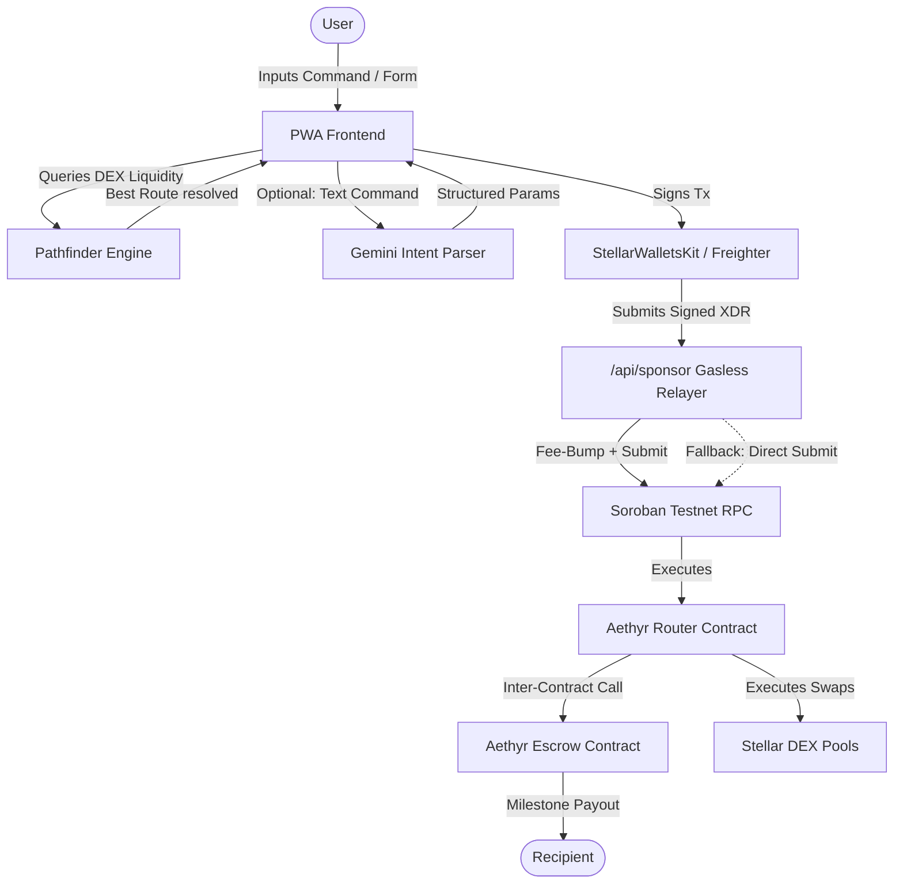
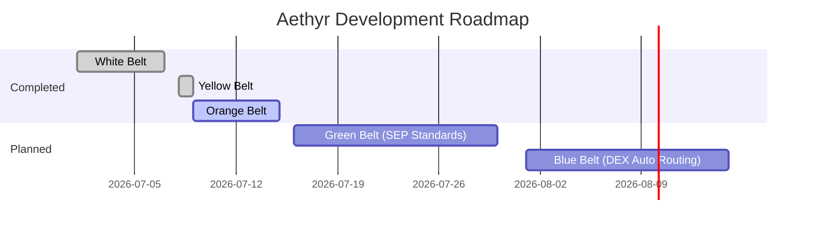

# Aethyr Hero Banner
<p align="center">
  
</p>

<h1 align="center">🌌 Aethyr</h1>
<p align="center">
  <strong>Intelligent, Intent-Based Cross-Border Payment Routing on Stellar</strong>
</p>

<p align="center">
  <a href="https://github.com/pablo-pica/aethyr/actions"></a>
  
  
  
  
  
  
</p>

---

## 💡 Value Proposition

Aethyr is an intent-based, cross-border payment router built on the Stellar network. By combining natural language artificial intelligence and decentralized exchange (DEX) liquidity, Aethyr optimizes multi-currency transaction paths in real-time to minimize fee footprints and slippage.

Traditional international remittance networks impose significant overhead through high flat fees, wide conversion spreads, and settlement delays. Aethyr addresses these issues through three main pillars:
* **AI-Driven Intent Parsing**: Users specify transactions in plain language (e.g., *"Send 50 USD equivalent in PHP to Bob for completing Milestone 1"*). Aethyr translates these inputs into structured transaction payloads.
* **DEX Pathfinding**: Aethyr calculates the most cost-effective path across Classic DEX orderbooks, automated market makers (AMMs), and Soroban liquidity pools (e.g., `PHP ➔ USDC ➔ XLM ➔ NGN`), maximizing the recipient's payout.
* **Non-Custodial Milestone Escrows**: Funds are secured inside modular Soroban milestone escrow contracts, releasing capital incrementally as milestones are completed and verified by trust anchors, with built-in dispute resolution and time-locked auto-release.

---

## 🏆 Core Achievements

### Smart Contract System (Soroban / Rust)
* 🔐 **Aethyr Router Contract** — Multi-hop DEX routing with atomic swaps and direct escrow funding.
  * **Address**: [`CA5ZEROS4VGIOZ2MIDVV7C7W4DFKWE76P4KBG455KO26RPKD2W3TC6MM`](https://stellar.expert/explorer/testnet/contract/CA5ZEROS4VGIOZ2MIDVV7C7W4DFKWE76P4KBG455KO26RPKD2W3TC6MM)
  * **Deployment Tx**: [`8ffea29ec2c445...`](https://stellar.expert/explorer/testnet/tx/8ffea29ec2c44577cfbc00a4c34b251a5e20a72c063a1ebf28dc0512cb78c01d)
* 🔐 **Aethyr Escrow Contract** — Milestone escrow contract invoked by Router.
  * **Address**: [`CD734V7PATOR7NW7APYQLUNEON2GZ7EUBM27MFQO3WDQZGCPKIWB6NOT`](https://stellar.expert/explorer/testnet/contract/CD734V7PATOR7NW7APYQLUNEON2GZ7EUBM27MFQO3WDQZGCPKIWB6NOT)
  * **Deployment Tx**: [`0362bad15f575c...`](https://stellar.expert/explorer/testnet/tx/0362bad15f575ce70d9ce291dd937ef39f2c7da2aaaaa07928bbf7ef8a8cd961)
* 🔐 **Aethyr Escrow Contract** — Freelancer milestone escrows with:
  * **Milestone submission** by freelancers with on-chain timestamp tracking.
  * **Client dispute** flags that block auto-release.
  * **7-day auto-release** timer for uncontested submitted milestones.
  * **30-day refund lock** to protect against dispute-bypassing refund attacks.
  * **Dust-truncation protection**: Final milestone payouts use the remaining locked balance instead of basis-point division to prevent token dust loss.
  * **11 passing Rust tests** covering happy paths, edge cases, and panic guards.

### Gasless Fee Sponsorship Relayer
* ⛽ **`/api/sponsor` Endpoint** — Server-side fee-bump transaction relayer that pays Soroban gas fees on behalf of users:
  * **Contract destination whitelisting**: Only `invokeHostFunction` calls targeting approved Aethyr contracts are sponsored (prevents fee-siphoning attacks).
  * **IP-based rate limiting**: 30 requests/minute per IP with `Retry-After` headers.
  * **Automatic client fallback**: If the relayer is unconfigured or fails, the frontend transparently falls back to user-paid fees.

### Frontend (Next.js 16 / TypeScript / Tailwind v4)
* 🦊 **Multi-Wallet Support**: StellarWalletsKit integration supporting Freighter, Albedo, and xBull via a unified modal selector.
* 🤖 **AI Intent Parser**: Gemini-powered natural language bar that converts human commands (e.g., *"Pay 100 XLM to GA... for Milestone 1"*) into structured transaction payloads.
* 📱 **PWA-Ready Layout**: Full-bleed mobile UI with safe-area notch handling, glassmorphic drawers, and a desktop phone-shell mockup.
* 🏗️ **Visual Milestone Builder**: Drag-and-edit milestone card editor for composing AI-drafted escrow milestones before on-chain submission.
* 🧪 **59 passing Vitest tests** covering AI parsing, page integration, component rendering, and API route logic.
* 🔒 **Pre-commit security hooks** scanning for Stellar private key leaks and running full test suites before every commit.

---

## 🎬 Live Demo & Presentation

* 🌐 **Live Application**: [Aethyr on Vercel](https://aethyr-pica.vercel.app/)
* 🎥 **Video Walkthrough**: [Local Walkthrough Video (MP4)](./docs/assets/video_demo.mp4)

---

## 🏗️ System Architecture

Aethyr connects users, AI models, and Stellar smart contracts into a unified payment loop:



The client queries Horizon endpoints to identify active market makers while the Soroban smart contracts execute atomic, multi-hop swaps directly on-chain. The gasless relayer sponsors transaction fees so end-users pay zero gas costs.

---

## 📂 Code Navigation

Below is a map of the repository's directory layout to assist in codebase evaluation:

```text
aethyr/
├── .agents/                 # Developer agents instruction and status trackers
├── .github/workflows/       # CI/CD pipeline configuration
│   └── ci.yml               # GitHub Actions: lint, test (Rust + Vitest), build
├── contracts/               # Soroban smart contracts (Rust)
│   └── aethyr-router/
│       ├── contracts/
│       │   ├── aethyr-escrow/   # Milestone escrow: create, release, dispute, auto-release, refund
│       │   │   ├── src/lib.rs   # Core escrow contract logic
│       │   │   └── src/test.rs  # 7 comprehensive Rust tests
│       │   └── aethyr-router/   # DEX routing: swap, fallback, route-to-escrow
│       │       ├── src/lib.rs   # Core router contract logic
│       │       └── src/test.rs  # 4 comprehensive Rust tests
│       └── Cargo.toml           # Workspace manifest
├── docs/                    # Design documentation, architecture files, and submission assets
│   ├── assets/              # Interface screenshots and project banners
│   ├── ARCHITECTURE.md      # Core system architecture and contract specs
│   ├── BELT-REQUIREMENTS.md # JTM belt submission checklists
│   ├── PROGRESS.md          # Real-time living development progress tracker
│   └── MASTERPLAN.md        # JTM milestones timeline and strategy plan
├── scripts/
│   └── pre-commit.sh        # Git compliance hook (secret scanning + test runner)
├── src/
│   ├── app/                 # Next.js App Router pages and layouts
│   │   ├── api/sponsor/     # Gasless relayer API route
│   │   │   ├── route.ts     # Fee-bump builder with contract whitelisting + rate limiting
│   │   │   └── route.test.ts# Relayer unit tests
│   │   ├── page.tsx         # Main entry point (interactive mobile mockup container)
│   │   ├── page.test.tsx    # Page component integration tests
│   │   └── layout.tsx       # Global wrappers and metadata setup
│   ├── components/          # Reusable React components
│   │   ├── ui/              # BottomSheet, CustomNumberInput, SegmentedControl, ConfirmationDialog, Toast, InfoTooltip
│   │   ├── BottomNav.tsx    # Mobile-friendly PWA bottom tab navigation
│   │   ├── MilestoneBuilder.tsx # Visual milestone card editor
│   │   ├── ProfileDrawer.tsx# Wallet balance overview and account control bottom sheet
│   │   ├── WalletPickerBottomSheet.tsx # Custom dark wallet picker
│   │   ├── SendTab.tsx      # Main Send / Swap view component
│   │   ├── EscrowTab.tsx    # Escrow Creation form and milestones tracker view
│   │   ├── ActivityTab.tsx  # Interactive transaction log view
│   │   ├── SettingsTab.tsx  # Configurable network and slippage preset controls
│   │   └── WalletConnect.tsx# Interactive wallet status controller
│   ├── hooks/
│   │   ├── useFreighter.ts  # Legacy Freighter-only hook
│   │   └── useStellarWallet.ts # Full-featured hook: StellarWalletsKit, contract calls, gasless submit
│   ├── lib/
│   │   ├── aiParser.ts      # Gemini AI intent parser (natural language → tx params)
│   │   ├── aiParser.test.ts # Parser unit tests (6 cases)
│   │   ├── utils.ts         # Tailwind CSS styling and address helper functions
│   │   └── utils.test.ts    # Utility unit tests
│   └── styles/
│       └── globals.css      # Core Tailwind styling & safe-area notch utility configuration
├── package.json             # Package scripts and external dependencies
├── tsconfig.json            # TypeScript configuration
└── vitest.config.ts         # Vitest setup configuration file
```

### Key Implementation Files
* [page.tsx](./src/app/page.tsx): Primary container UI with tabs, forms, activity ledger, and milestone actions.
* [lib.rs (Escrow)](./contracts/aethyr-router/contracts/aethyr-escrow/src/lib.rs): Milestone escrow logic — create, release, submit, dispute, auto-release, refund.
* [lib.rs (Router)](./contracts/aethyr-router/contracts/aethyr-router/src/lib.rs): Payment routing contract — DEX swaps and escrow funding.
* [useStellarWallet.ts](./src/hooks/useStellarWallet.ts): Full-featured wallet hook — multi-wallet, contract calls, gasless relayer integration with exponential backoff.
* [route.ts (Sponsor)](./src/app/api/sponsor/route.ts): Gasless relayer with contract whitelisting and rate limiting.
* [aiParser.ts](./src/lib/aiParser.ts): Gemini AI intent parser converting natural language to structured payloads.
* [MilestoneBuilder.tsx](./src/components/MilestoneBuilder.tsx): Visual milestone card editor.
* [pre-commit.sh](./scripts/pre-commit.sh): Git compliance hook — secret scanning and full test runner.

---

## 🔒 Security Model

| Threat | Mitigation |
|:-------|:-----------|
| **Fee-siphoning** via arbitrary contract calls | Relayer parses XDR operations and only sponsors `invokeHostFunction` calls targeting approved Aethyr contracts |
| **Rate-drain attacks** on sponsor wallet | IP-based rate limiter (30 req/min) with `429 Retry-After` responses |
| **Dispute-bypass refund** | Refund lock extended to 30 days (`LOCK_PERIOD_SECONDS`) so disputes cannot be front-run |
| **Dust token loss** on final milestone | Final milestone pays out full remaining balance instead of basis-point calculation |
| **Private key leaks** | Pre-commit hook scans diffs for Stellar seed patterns; `SPONSOR_SECRET_KEY` is never committed |
| **Unconfigured relayer in production** | Fail-fast `503` if `SPONSOR_SECRET_KEY` is absent; random fallback key only in `test` env |

---

## 🏅 Belt Submission Evidence

Each belt section below maps **1:1** against the [Belt Requirements](./docs/BELT-REQUIREMENTS.md) checklist. Every requirement links directly to its proof — source file, Stellar Explorer transaction, or screenshot.

---

### ⚪ White Belt — Foundational PWA Container

<details>
<summary><strong>✅ All Requirements Met — Click to expand</strong></summary>

#### Core Tasks

| # | Requirement | Status | Evidence |
|:-:|:-----------|:------:|:---------|
| 1 | Connect a wallet via Freighter | ✅ | [`useFreighter.ts`](./src/hooks/useFreighter.ts) — `connect()` calls `requestAccess()` |
| 2 | Display connected wallet XLM balance | ✅ | [`useStellarWallet.ts`](./src/hooks/useStellarWallet.ts) — `fetchBalance()` queries Horizon |
| 3 | Wallet disconnect functionality | ✅ | [`useStellarWallet.ts`](./src/hooks/useStellarWallet.ts) — `disconnect()` resets state |
| 4 | Send a transaction on Stellar Testnet | ✅ | [`useStellarWallet.ts`](./src/hooks/useStellarWallet.ts) — `sendPayment()` builds and submits native XLM transfers |
| 5 | Display transaction feedback (success/failure) | ✅ | [`page.tsx`](./src/app/page.tsx) — toast notifications on tx result |
| 6 | Show transaction hash on completion | ✅ | [`page.tsx`](./src/app/page.tsx) — Activity ledger displays tx hash with explorer link |

#### Submission Assets

| Asset | Screenshot |
|:------|:----------:|
| **Wallet connected** — public key/address visible |  |
| **XLM balance** displayed in UI |  |
| **Successful testnet transaction** being executed |  |
| **Transaction result** — hash/confirmation shown |  |

</details>

---

### 🟡 Yellow Belt — Soroban Smart Contracts

<details>
<summary><strong>✅ All Requirements Met — Click to expand</strong></summary>

#### Core Tasks

| # | Requirement | Status | Evidence |
|:-:|:-----------|:------:|:---------|
| 1 | Error handling for 3+ transaction error types | ✅ | [`useStellarWallet.ts`](./src/hooks/useStellarWallet.ts) — handles: **Wallet not found**, **User rejected**, **Insufficient balance** |
| 2 | Deploy a Soroban smart contract to Testnet | ✅ | Router contract: [`CA5ZERO...6MM`](https://stellar.expert/explorer/testnet/contract/CA5ZEROS4VGIOZ2MIDVV7C7W4DFKWE76P4KBG455KO26RPKD2W3TC6MM) |
| 3 | Call a contract function from the frontend | ✅ | [`useStellarWallet.ts`](./src/hooks/useStellarWallet.ts) — `routeToEscrow()`, `releaseMilestone()`, etc. invoke Soroban |
| 4 | Multi-wallet integration (StellarWalletsKit) | ✅ | [`useStellarWallet.ts`](./src/hooks/useStellarWallet.ts) — initializes `StellarWalletsKit` with `defaultModules()` (Freighter, Albedo, xBull) |
| 5 | Display contract tx status (pending/success/fail) | ✅ | [`page.tsx`](./src/app/page.tsx) — status badges + toast notifications for all contract operations |

#### On-Chain Proof

| Artifact | Value |
|:---------|:------|
| **Deployed Contract Address** | [`CA5ZEROS4VGIOZ2MIDVV7C7W4DFKWE76P4KBG455KO26RPKD2W3TC6MM`](https://stellar.expert/explorer/testnet/contract/CA5ZEROS4VGIOZ2MIDVV7C7W4DFKWE76P4KBG455KO26RPKD2W3TC6MM) |
| **Deployment Tx Hash** | [`8ffea29ec2c445...`](https://stellar.expert/explorer/testnet/tx/8ffea29ec2c44577cfbc00a4c34b251a5e20a72c063a1ebf28dc0512cb78c01d) |
| **Frontend Invocation Tx Hash** | [`cf417f87e58e3a...`](https://stellar.expert/explorer/testnet/tx/cf417f87e58e3a4cc53d4ee572115474afea0568609fbde6e49df2d8c5d14623) |
| **Commit Count** | 65+ conventional commits ([`git log`](https://github.com/pablo-pica/aethyr/commits/dev-branch)) |

#### Submission Assets

| Asset | Screenshot |
|:------|:----------:|
| **Multi-wallet modal** — Freighter, Albedo, xBull visible |  |
| **Contract call status** — pending/success/fail feedback |  |

</details>

---

### 🟠 Orange Belt — Advanced Contracts, CI/CD & Production Architecture

<details open>
<summary><strong>🔧 In Progress — Click to expand</strong></summary>

#### Core Tasks

| # | Requirement | Status | Evidence |
|:-:|:-----------|:------:|:---------|
| 1a | **Inter-contract communication** | ✅ | Router calls Escrow via `route_to_escrow()` → [`lib.rs (Router)`](./contracts/aethyr-router/contracts/aethyr-router/src/lib.rs) invokes [`lib.rs (Escrow)`](./contracts/aethyr-router/contracts/aethyr-escrow/src/lib.rs) |
| 1b | **Event streaming** from contracts | ✅ | Both contracts emit events via `env.events().publish(...)` — see [`lib.rs (Escrow) L179, L262, L306, L347, L388, L462`](./contracts/aethyr-router/contracts/aethyr-escrow/src/lib.rs) |
| 2 | **CI/CD pipeline** (lint + test + build) | ✅ | GitHub Actions: [`.github/workflows/ci.yml`](./.github/workflows/ci.yml) — runs `npm run lint`, `npm run test`, `npm run build`, and `cargo test` on every push/PR |
| 3 | **Mobile-responsive PWA** with safe-area notch | ✅ | [`globals.css`](./src/styles/globals.css) — `env(safe-area-inset-*)` + [`page.tsx`](./src/app/page.tsx) — max-width 420px phone shell |
| 4 | **Error handling & state indicators** | ✅ | Loading spinners, skeleton UI, toast notifications throughout [`page.tsx`](./src/app/page.tsx) and [`WalletConnect.tsx`](./src/components/WalletConnect.tsx) |
| 5a | **Smart contract tests** (Rust) | ✅ | **11 tests passing**: 7 in [`test.rs (Escrow)`](./contracts/aethyr-router/contracts/aethyr-escrow/src/test.rs) + 4 in [`test.rs (Router)`](./contracts/aethyr-router/contracts/aethyr-router/src/test.rs) |
| 5b | **Frontend tests** (Vitest) | ✅ | **59 tests passing** across 17 files |
| 6 | **Production-ready architecture** | ✅ | Gasless relayer with contract whitelisting, rate limiting, 30-day refund lock, dust-truncation fix — see [Security Model](#-security-model) |

#### Codebase Requirements

| Requirement | Status | Evidence |
|:-----------|:------:|:---------|
| Public GitHub repository | ✅ | [github.com/pablo-pica/aethyr](https://github.com/pablo-pica/aethyr) |
| 10+ meaningful commits | ✅ | **65+ conventional commits** — `feat:`, `fix:`, `test:`, `docs:`, `ci:` |
| Live demo on Vercel/Netlify | ✅ | [aethyr-pica.vercel.app](https://aethyr-pica.vercel.app/) |
| No hardcoded secrets | ✅ | All secrets via `.env.local` + [pre-commit hook](./scripts/pre-commit.sh) scanning for Stellar seeds |

#### On-Chain Proof

| Artifact | Value |
|:---------|:------|
| **Verified Escrow Contract** | [`CD734V7PATOR7NW7APYQLUNEON2GZ7EUBM27MFQO3WDQZGCPKIWB6NOT`](https://stellar.expert/explorer/testnet/contract/CD734V7PATOR7NW7APYQLUNEON2GZ7EUBM27MFQO3WDQZGCPKIWB6NOT) |
| **Inter-Contract Call Tx Hash** | [`cf417f87e58e3a4cc53d4ee572115474afea0568609fbde6e49df2d8c5d14623`](https://stellar.expert/explorer/testnet/tx/cf417f87e58e3a4cc53d4ee572115474afea0568609fbde6e49df2d8c5d14623) |

#### Submission Assets

| Asset | Screenshot |
|:------|:----------:|
| **Mobile viewport** — responsive UI on small screen |  |
| **GitHub Actions CI/CD** — green/passing pipeline |  |
| **Test suite output** — 11 Rust + 59 Vitest passing |  |
| **Video walkthrough** | [Walkthrough Video (MP4)](./docs/assets/video_demo.mp4) |

#### Extra Showcase Views

| View | Screenshot |
|:-----|:----------:|
| **Create Escrow** — client configuration form |  |
| **Milestone Builder** — visual milestone designer sheet |  |
| **Active Escrows** — freelancer task tracking view |  |
| **Settings Tab** — slippage control, network toggles, AI configs |  |

</details>

---

## 🛠️ Step-by-Step Quickstart

Follow these instructions to run Aethyr locally on your development machine.

### 1. Prerequisites
Ensure you have the following installed:
* **Node.js**: v20 or later
* **npm**: v10 or later
* **Rust / Cargo**: For compiling Soroban contracts
* **Stellar CLI** (Optional, for contract invokes): `cargo install --locked stellar-cli`

### 2. Project Installation
```bash
# Clone the repository
git clone https://github.com/pablo-pica/aethyr.git
cd aethyr

# Install project dependencies
npm install
```

### 3. Environment Configuration
Duplicate the example environment file:
```bash
cp .env.example .env.local
```

Open [env.local](./.env.local) and customize its parameters:
* `NEXT_PUBLIC_STELLAR_NETWORK`: Configures the target chain network. Set to `TESTNET` for public testing.
* `NEXT_PUBLIC_STELLAR_RPC_URL`: The RPC endpoint used for Horizon queries (e.g., `https://soroban-testnet.stellar.org:443`).
* `NEXT_PUBLIC_ROUTER_CONTRACT_ID`: The deployed Soroban router contract address (`CB...`).
* `NEXT_PUBLIC_ESCROW_CONTRACT_ID`: The deployed Soroban escrow contract address (`CC...`).
* `NEXT_PUBLIC_GEMINI_API_KEY`: The API key utilized to authenticate with the Gemini API for plain text intent parsing.
* `SPONSOR_SECRET_KEY`: *(Optional)* Secret key of the fee-sponsoring account. If unset, the gasless relayer is disabled and users pay their own fees.

### 4. Running the Development Server
```bash
npm run dev
```
Open [http://localhost:3000](http://localhost:3000) inside your web browser to test.

### 5. Running Verification Suites
Verify code health by running the verification commands:
```bash
# Run frontend unit and integration tests (Vitest)
npm test

# Run smart contract tests (Rust)
cd contracts/aethyr-router && cargo test

# Run code style and structure lints (Next.js ESLint)
npm run lint
```

---

## 🗺️ Product Roadmap



| Belt | Focus | Status |
|:-----|:------|:------:|
| ⚪ White | Wallet connect, XLM transfers, PWA layout | ✅ Complete |
| 🟡 Yellow | Soroban contracts, multi-wallet, error handling | ✅ Complete |
| 🟠 Orange | Inter-contract calls, CI/CD, tests, gasless relayer | 🔧 In Progress |
| 🟢 Green | SEP-24/38 anchor integration, fiat on-ramps | 📋 Planned |
| 🔵 Blue | DEX pathfinding engine, multi-hop routing | 📋 Planned |

---

## 📄 License
This project is licensed under the MIT License - see the [LICENSE](LICENSE) file for details.
