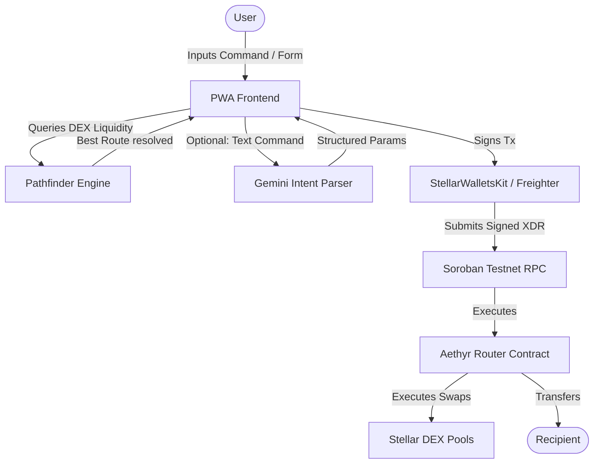

# 🌌 Aethyr — README Template

This template defines the layout and content for the final repository README. As we complete each belt level, we update the README in the root folder based on these placeholders.

---

```markdown
<!-- Aethyr Hero Banner (Generated by AI) -->
<p align="center">
  
</p>

<h1 align="center">🌌 Aethyr</h1>
<p align="center">
  <strong>Intelligent Cross-Border Payment Routing on Stellar</strong>
</p>

<p align="center">
  <a href="https://github.com/pablo-pica/aethyr/actions"></a>
  
  
  
</p>

---

## 📝 Overview

Aethyr is an installable, mobile-first Progressive Web App (PWA) designed to route multi-currency transactions across borders with maximum efficiency and minimum fee footprint. 

By analyzing Stellar DEX orderbooks in real-time, Aethyr pathfinds optimal trade routes (e.g., PHP -> USDC -> XLM -> NGN) to send payments. It features a Gemini-powered AI Smart Assist layer that translates plain-text payment commands into structured blockchain transactions.

---

## 🎬 Live Demo & Presentation

- 🌐 **Live Application**: [Aethyr on Vercel](https://your-vercel-link.vercel.app)
- 🎥 **Video walkthrough (1-2 Min)**: [Aethyr Demo Video](https://loom.com/your-video-link)

---

## 📱 Mobile App Viewports

Aethyr is designed to feel like a native mobile application. Below is the core user journey inside our custom phone frame interface.

| Wallet Connection | Intent Parsing | Route Optimization | Transaction Receipt |
|:---:|:---:|:---:|:---:|
|  |  |  |  |

---

## ✨ Features

- 🦊 **Multi-Wallet Gateway**: Connect Freighter, Albedo, or xBull with one tap using StellarWalletsKit.
- 🔀 **Orderbook Pathfinder**: Locally resolves optimal token routing to minimize slippage and trading costs.
- 🔮 **AI Smart Assist**: Type "Send 50 USD equivalent in PHP to Alice" and let the AI populate the payment parameters automatically.
- 🔏 **Milestone Escrow Contract**: Lock payments on-chain, releasing funds only as milestones are verified.
- 📶 **Offline Operations**: Built-in service worker allows access to wallet balances and route history offline.

---

## 🏗️ System Architecture



---

## 🛠️ Tech Stack

- **Frontend**: Next.js 15 (App Router, TypeScript)
- **Styling**: Tailwind CSS v4 (Mobile Notch Safe viewport spacing)
- **Blockchain Connectivity**: `@stellar/stellar-sdk` & `@stellar/freighter-api`
- **Smart Contracts**: Soroban SDK (Rust v1.84+)
- **CI/CD**: GitHub Actions (Linting, cargo tests, frontend tests)
- **Testing**: Vitest + Soroban Unit Test Framework

---

## 🚀 Quick Start (Local Setup)

### 1. Prerequisites
Ensure you have Rust, Node.js (v20+), and Cargo installed.

```bash
# Install Stellar CLI
cargo install --locked stellar-cli
```

### 2. Installation & Setup
```bash
# Clone the repository
git clone https://github.com/pablo-pica/aethyr.git
cd aethyr

# Install dependencies
npm install

# Setup environment variables
cp .env.example .env.local
```

### 3. Run the Development Server
```bash
# Run Next.js server
npm run dev
```

---

## 🧪 Verification & Testing

### 1. Smart Contract Unit Tests (Rust)
```bash
cd contracts
cargo test
```
*Screenshot showing terminal output of passing tests:*
<p align="left">
  
</p>

### 2. Frontend Tests (Vitest)
```bash
npm run test
```
*Screenshot showing terminal output of passing frontend tests:*
<p align="left">
  
</p>

### 3. CI/CD Validation
*Screenshot showing passing build and lint pipelines in GitHub Actions:*
<p align="left">
  
</p>

---

## 📊 Deployed Smart Contracts

| Contract Alias | Testnet Contract Address | Verification Link (Explorer) |
|---|---|---|
| `aethyr-router` | `CB...` | [View on Stellar Explorer](https://stellar.expert/explorer/testnet/contract/CB...) |
| `aethyr-escrow` | `CC...` | [View on Stellar Explorer](https://stellar.expert/explorer/testnet/contract/CC...) |

### Sample Transaction Invocation
- **Purpose**: Aethyr-Router contract execution (Escrow create call).
- **Transaction Hash**: `abc123xyz...`
- **Verification Link**: [View Transaction](https://stellar.expert/explorer/testnet/tx/abc123xyz...)

---

## 📄 License
This project is licensed under the MIT License - see the [LICENSE](LICENSE) file for details.
```
